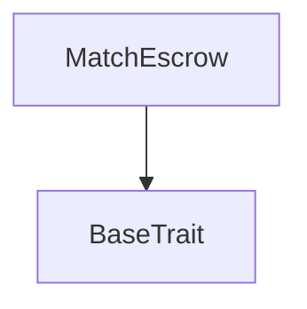
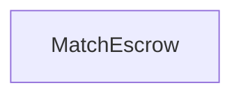

# Tact compilation report
Contract: MatchEscrow
BoC Size: 4078 bytes

## Structures (Structs and Messages)
Total structures: 30

### DataSize
TL-B: `_ cells:int257 bits:int257 refs:int257 = DataSize`
Signature: `DataSize{cells:int257,bits:int257,refs:int257}`

### SignedBundle
TL-B: `_ signature:fixed_bytes64 signedData:remainder<slice> = SignedBundle`
Signature: `SignedBundle{signature:fixed_bytes64,signedData:remainder<slice>}`

### StateInit
TL-B: `_ code:^cell data:^cell = StateInit`
Signature: `StateInit{code:^cell,data:^cell}`

### Context
TL-B: `_ bounceable:bool sender:address value:int257 raw:^slice = Context`
Signature: `Context{bounceable:bool,sender:address,value:int257,raw:^slice}`

### SendParameters
TL-B: `_ mode:int257 body:Maybe ^cell code:Maybe ^cell data:Maybe ^cell value:int257 to:address bounce:bool = SendParameters`
Signature: `SendParameters{mode:int257,body:Maybe ^cell,code:Maybe ^cell,data:Maybe ^cell,value:int257,to:address,bounce:bool}`

### MessageParameters
TL-B: `_ mode:int257 body:Maybe ^cell value:int257 to:address bounce:bool = MessageParameters`
Signature: `MessageParameters{mode:int257,body:Maybe ^cell,value:int257,to:address,bounce:bool}`

### DeployParameters
TL-B: `_ mode:int257 body:Maybe ^cell value:int257 bounce:bool init:StateInit{code:^cell,data:^cell} = DeployParameters`
Signature: `DeployParameters{mode:int257,body:Maybe ^cell,value:int257,bounce:bool,init:StateInit{code:^cell,data:^cell}}`

### StdAddress
TL-B: `_ workchain:int8 address:uint256 = StdAddress`
Signature: `StdAddress{workchain:int8,address:uint256}`

### VarAddress
TL-B: `_ workchain:int32 address:^slice = VarAddress`
Signature: `VarAddress{workchain:int32,address:^slice}`

### BasechainAddress
TL-B: `_ hash:Maybe int257 = BasechainAddress`
Signature: `BasechainAddress{hash:Maybe int257}`

### DeployMatch
TL-B: `deploy_match#127b5e95 matchId:uint64 wagerAmount:coins recruiterA:address groupAdminAddress:address = DeployMatch`
Signature: `DeployMatch{matchId:uint64,wagerAmount:coins,recruiterA:address,groupAdminAddress:address}`

### JoinMatch
TL-B: `join_match#46024d54 matchId:uint64 recruiterB:address = JoinMatch`
Signature: `JoinMatch{matchId:uint64,recruiterB:address}`

### BetSpectator
TL-B: `bet_spectator#c8998cb6 matchId:uint64 targetPlayer:address = BetSpectator`
Signature: `BetSpectator{matchId:uint64,targetPlayer:address}`

### ResolveMatch
TL-B: `resolve_match#2d15922d matchId:uint64 winner:address timestamp:uint32 signature:^slice = ResolveMatch`
Signature: `ResolveMatch{matchId:uint64,winner:address,timestamp:uint32,signature:^slice}`

### ClaimSpectatorReward
TL-B: `claim_spectator_reward#c1b57e3c matchId:uint64 = ClaimSpectatorReward`
Signature: `ClaimSpectatorReward{matchId:uint64}`

### CancelMatch
TL-B: `cancel_match#a2cff8f8 matchId:uint64 reason:^string signature:^slice = CancelMatch`
Signature: `CancelMatch{matchId:uint64,reason:^string,signature:^slice}`

### EmergencyRefund
TL-B: `emergency_refund#e167214a matchId:uint64 = EmergencyRefund`
Signature: `EmergencyRefund{matchId:uint64}`

### SetServerPublicKey
TL-B: `set_server_public_key#ddf158a6 newKey:uint256 = SetServerPublicKey`
Signature: `SetServerPublicKey{newKey:uint256}`

### EventMatchCreated
TL-B: `event_match_created#0b3af9c2 matchId:uint64 playerA:address wagerAmount:coins creationFee:coins = EventMatchCreated`
Signature: `EventMatchCreated{matchId:uint64,playerA:address,wagerAmount:coins,creationFee:coins}`

### EventPlayerJoined
TL-B: `event_player_joined#01e248d9 matchId:uint64 playerB:address = EventPlayerJoined`
Signature: `EventPlayerJoined{matchId:uint64,playerB:address}`

### EventSpectatorBet
TL-B: `event_spectator_bet#68764a9f matchId:uint64 spectator:address targetPlayer:address amount:coins totalBetsA:coins totalBetsB:coins = EventSpectatorBet`
Signature: `EventSpectatorBet{matchId:uint64,spectator:address,targetPlayer:address,amount:coins,totalBetsA:coins,totalBetsB:coins}`

### EventMatchResolved
TL-B: `event_match_resolved#4a76f1b4 matchId:uint64 winner:address playerPotPayout:coins totalPlayerRake:coins distributableSpectatorPool:coins totalSpectatorRake:coins = EventMatchResolved`
Signature: `EventMatchResolved{matchId:uint64,winner:address,playerPotPayout:coins,totalPlayerRake:coins,distributableSpectatorPool:coins,totalSpectatorRake:coins}`

### EventSpectatorClaim
TL-B: `event_spectator_claim#0b5d9198 matchId:uint64 spectator:address payout:coins = EventSpectatorClaim`
Signature: `EventSpectatorClaim{matchId:uint64,spectator:address,payout:coins}`

### EventAffiliatePayout
TL-B: `event_affiliate_payout#ecc7afe0 matchId:uint64 recipient:address amount:coins reason:^string = EventAffiliatePayout`
Signature: `EventAffiliatePayout{matchId:uint64,recipient:address,amount:coins,reason:^string}`

### MatchEscrow$Data
TL-B: `_ clashMaster:address matchId:uint64 playerA:address playerB:address wagerAmount:coins totalBetsA:coins totalBetsB:coins state:uint8 recruiterA:address recruiterB:address groupAdminAddress:address serverPublicKey:uint256 winner:address creationFeePaid:coins spectatorBetsA:dict<address, coins> spectatorBetsB:dict<address, coins> spectatorClaimed:dict<address, bool> distributableSpectatorPool:coins remainingWinningBetsToClaim:coins totalWinningBets:coins = MatchEscrow`
Signature: `MatchEscrow{clashMaster:address,matchId:uint64,playerA:address,playerB:address,wagerAmount:coins,totalBetsA:coins,totalBetsB:coins,state:uint8,recruiterA:address,recruiterB:address,groupAdminAddress:address,serverPublicKey:uint256,winner:address,creationFeePaid:coins,spectatorBetsA:dict<address, coins>,spectatorBetsB:dict<address, coins>,spectatorClaimed:dict<address, bool>,distributableSpectatorPool:coins,remainingWinningBetsToClaim:coins,totalWinningBets:coins}`

### MatchEscrowDetails
TL-B: `_ matchId:uint64 playerA:address playerB:address wagerAmount:coins totalBetsA:coins totalBetsB:coins state:uint8 winner:address distributableSpectatorPool:coins remainingWinningBetsToClaim:coins = MatchEscrowDetails`
Signature: `MatchEscrowDetails{matchId:uint64,playerA:address,playerB:address,wagerAmount:coins,totalBetsA:coins,totalBetsB:coins,state:uint8,winner:address,distributableSpectatorPool:coins,remainingWinningBetsToClaim:coins}`

### RakeDistribution
TL-B: `_ treasuryShare:coins recruiterShare:coins groupAdminShare:coins = RakeDistribution`
Signature: `RakeDistribution{treasuryShare:coins,recruiterShare:coins,groupAdminShare:coins}`

### WithdrawTreasury
TL-B: `withdraw_treasury#428ecd6a amount:coins recipient:address = WithdrawTreasury`
Signature: `WithdrawTreasury{amount:coins,recipient:address}`

### MasterStats
TL-B: `_ matchCount:uint64 serverPublicKey:uint256 owner:address balance:coins = MasterStats`
Signature: `MasterStats{matchCount:uint64,serverPublicKey:uint256,owner:address,balance:coins}`

### ClashMaster$Data
TL-B: `_ owner:address serverPublicKey:uint256 matchCount:uint64 = ClashMaster`
Signature: `ClashMaster{owner:address,serverPublicKey:uint256,matchCount:uint64}`

## Get methods
Total get methods: 4

## getMatchDetails
No arguments

## getSpectatorBetA
Argument: spectator

## getSpectatorBetB
Argument: spectator

## hasSpectatorClaimed
Argument: spectator

## Exit codes
* 2: Stack underflow
* 3: Stack overflow
* 4: Integer overflow
* 5: Integer out of expected range
* 6: Invalid opcode
* 7: Type check error
* 8: Cell overflow
* 9: Cell underflow
* 10: Dictionary error
* 11: 'Unknown' error
* 12: Fatal error
* 13: Out of gas error
* 14: Virtualization error
* 32: Action list is invalid
* 33: Action list is too long
* 34: Action is invalid or not supported
* 35: Invalid source address in outbound message
* 36: Invalid destination address in outbound message
* 37: Not enough Toncoin
* 38: Not enough extra currencies
* 39: Outbound message does not fit into a cell after rewriting
* 40: Cannot process a message
* 41: Library reference is null
* 42: Library change action error
* 43: Exceeded maximum number of cells in the library or the maximum depth of the Merkle tree
* 50: Account state size exceeded limits
* 128: Null reference exception
* 129: Invalid serialization prefix
* 130: Invalid incoming message
* 131: Constraints error
* 132: Access denied
* 133: Contract stopped
* 134: Invalid argument
* 135: Code of a contract was not found
* 136: Invalid standard address
* 138: Not a basechain address
* 2892: Betting closed for this match
* 5118: Only Master can trigger emergency sweep
* 5525: Player A cannot play against self
* 7119: Match ID mismatch
* 8675: Match not resolved yet
* 8932: Player B missing
* 12920: Unauthorized match cancellation
* 14246: Match already active or settled
* 16276: Already claimed reward
* 17825: Invalid target player
* 20614: No winning bet found for sender
* 23966: Invalid Ed25519 resolution signature
* 25099: Minimum spectator bet is 0.1 TON
* 26109: Insufficient TON sent for deployment and initial wager
* 26244: Winner not set
* 27099: Zero payout calculated
* 35852: Insufficient wager amount sent
* 42964: Only owner can withdraw treasury funds
* 46500: Invalid winner
* 46817: Only owner can update server public key
* 57629: Match must be active to resolve
* 59295: Cannot cancel resolved match
* 59759: Reserve minimum storage balance

## Trait inheritance diagram

## Contract dependency diagram

